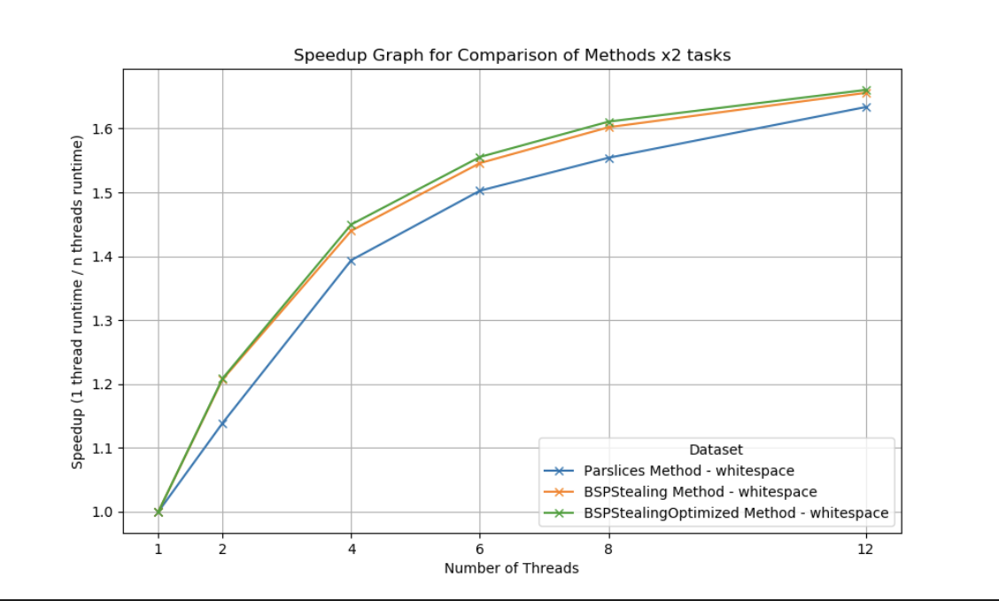

# Proj 3 : Convolutional WorkStealing

### **1. Describe your program and the problem it is trying to solve in detail.**

- Image processing, especially convolutional operations, is computationally intensive and can be time-consuming, particularly for high-resolution images or complex effects. Convolution involves applying a filter or kernel to each pixel or a group of pixels of an image, which can result in significant processing delays when done sequentially.
- **Adding a new filtering in this project**, taking inspiration from background image removal. I applied a new filter to convert black(RGB 0,0,0) pixel into transparent pixel. This addition filtering will immediately return after it sees black pixel, simulating load imbalanced across slices, as regions with more black pixels will finish quicker, encouraging work stealing among processing workers.

### **Challenges**

- **Performance Bottlenecks and large image handling:** Sequential processing of computational intensive effects can lead to significant delays. Also, processing large images in a single thread can lead to underutilization of CPU resources, as the operation can be I/O bound, CPU bound, or both.

### Parallel Programming

- The attempt is to use parallel programming to improve the program performance. Parallel programming utilize multiple core processor architecture or in this project the parallel go routine to increase throughput and reduce latency.
- The approach I took is modification of `Parslices`, dividing image into multiple horizontal slices and sprawn go routine to apply the effect. Each effect is treated like one superstep (BSP). It is the barrier that keeps all go routines before starting the next effect, the image needs to be saved before going to the next effect.
- `ParslicesBSP` enhances resource allocation with work stealing, workstealing optimizing load imbalance and leading to higher throughput because there will be less idle workers.
- The `parslices` approach increases scalibility on to high resolution image or when the system has multiple cores. This solution prevents I/O bound issue.

### **2.1 Description of how you implemented your parallel solutions**

**Sequential Implementation :**

- **Sequential** is working with each image and each effect step by step by iteration method.

    `go run ../editor/editor.go small`


**Implementation :**

- **Parallel**:
    - I tested the image on 2 datasets: small/ and whitespace/. Record the running time for {1,2,4,8,12} threads, compare the SpeedUp time when using different strategies.
    - Run on \whitespace dataset with 6 threads.

        ```go
        go run ../editor/editor.go whitespace parslices 6
        go run ../editor/editor.go whitespace parslicesBSP 6
        ```

- `Parslices` Parallel by Slices

    I split the images into height / (threads x **2**) chucks. Each go routine is applying effect on each chunk parallelly. The number `2` indicates the number of tasks enques to each worker. It can be changed to observe patterns when tasks have more granularity.

    **Implementation**:

    - Calculate the split area : how many rows in the image should one go routine to be working.
    - Pop the image from the queue one by one.
    - Per each effect, sprawl n go routines. Each go routine apply effect on its slice parallelly. Wait for everyone to finish one effect before moving to the next effect.
- `ParslicesBSP` : Parallel by Slices with work stealing
    - Enhancing the load balancing in the program with work stealing. I divided the chunk such that each go workers have x2 tasks in their DEqueue (Double Ended Queue).
    - Once go worker finished all tasks in its own DEqueue, it’ll try to steal **randomly** from other workers’ DEqueue. When there’s no task left. The go worker exit.
    - After each go worker exits, it needs to wait for all other workers to exit (BSP) before moving on to the next effect. I implement this synchronization with Condition Variable.
    - The DEqueue implemented with stamp to address ABA problem.
- `ParslicesBSPOptimized` :
    - optimized `ParslicesBSP` with parallel enqueing. This is to address the speculations that enquing is the hotspots in the `parslicesBPS` program.

### Note about Convolutions

Convolution Kernel :

- For convolutional calculation, I’ll be using kernel weights on the pixel and its 8 surrounding pixels. The sum of the effects will become the new image pixel.

### Input and Output Images

Download data [input](https://drive.google.com/drive/folders/1MkoK9dNwZaK_zUusTkmEdgHMp9U5THQT?usp=sharing) zip file

- The /small data set is the same as the proj1. You can choose to download just /whitespace zip file.

- After applying effects and turn black pixel to transparent
    - `/small`

|       |       |
| :---: | :---: |
|   |  |
| in/IMG_4069 | out/IMG_4069 |

- `/whitespace`

|       |       |
| :---: | :---: |
|   |  |
| Untitled | Untitled |

---

### **2.2 Why the approach you picked (BSP, map-reduce, pipelining) is the most appropriate. You probably want to discuss things like load balancing, latency/throughput, etc.**

1. **BSP**: each effect has a super step, using BSP condition variable is appropriate to synchronize all workers before moving forward to the next step. This is because the next effect relies on the result from the previous effects.
2. **Load Balancing & WorkStealing :**
    1. The enhancement with workstealing in `ParslicesBSP` address key challenges in parallel image processing: load imbalance. Some image regions (slices) may process faster than others due to variations in pixel data (e.g., many black pixels leading to early exits in my new filter).
    2. Workstealing solves the problem when there’s non-uniform workloads across each slice. Dynamically redistribute the workload of go workers.
3. **Latency & Throughput** :
    1. BSP may increase latency due to the superstep synchronization, however the structured barrier helps create a predictable structure that allows us to reduce the idle worker more effectively. The barrier ensures that work is distributed evenly after each barrier. This allows all resources to be utilized optimally and we can apply load balancing to reduce latency in each barrier.
    2. BSP increases throughput. With supersteps synchronization, BSP minimizes the idle workers. This means it is maximizing the active processor and increase throughput collectively.
    3. The predictable waiting time at the the barrier in BSP helps us apply optimization more effectively ie. using work stealing. In contrast to the irregular wait time without BSP, managing latency is difficult and unpredictable.
4. **Comparison with Other Techniques**
    1. Map Reduce
    Best suited for task that has independent chunks. However, image processing tasks depends on neighboring pixels and effects, the BSP model is better fits to the interdependence nature of project.
    2. Pipelining

        Pipelining while it has less major synchronization phase than BSP, it may increase the complexity of synchronization when it is dealing with boarder of each image slice. The pixels in the boarders still requires synchronization because of its dependency.


### 3. Challenges

What aspects of the system might make it difficult to parallelize? In other words, what did you hope to learn by doing this assignment?

**Challenges :**

- Work Stealing doesn’t significantly improve the performance of my program when I used `/small` dataset. However, after using the `/whitespace` dataset that simulate load imbalance, the performance has shown to be improved.
- I’ve changed from work stealing sequentially in a loop into random work stealing. This has helped improve performance a little.
- The speedUp graph shows some unexpected behavior when I enque x4 tasks per worker (see analysis below). The challenge lies in debugging and trying to understand the causes of performance irregularity.
- Some other mistake I made is when checking for DEQueue empty must be checking the top and bottom indices, instead of the array length which is always fixed.

**Parts that are difficult to parallelize :**

- There are parts that are bottleneck that must be implement in sequential.
- Enqueing tasks is bottleneck : with more granularity of tasks to enque, there are more calculations and hence more computational overheads
- CAS lock in stealing tasks is a bottleneck. Atomic operation can leads to delay when there’re contentions to try to modify on the same DEqueue.
- BSP Supersteps are bottleneck. Requires all processing threads to wait at the barrier. This may lead to some faster tasks idle wait. However, this problem is addressed with workstealing.

**Learn by doing this assignment :**

- **Real-world application** : Applying parallel programming on a personal project, in contrast to the school set up where many nuances are eliminated. Working on the project like this allows me to choose the methods and analyze the potential of overheads and optimization. Which can be challenging but is helpful to develop skills to analyze parallel programming project.
- **Understanding work stealing :** applying work stealing may sounds like an optimization at first. However, there are some considerations I observed when using work stealing
    - **The nature of the project,** the comparison between /small and /whitespace dataset performance show that applying work stealing with the imbalaned load project is more beneficial.
    - **Task Granularity**: The efficiency of work stealing heavily depends on the granularity of tasks. Too fine-grained tasks can lead to excessive overhead, while too coarse-grained tasks might not allow the benefit of stealing.
    - **Synchronization Overhead:** Accessing and modifying shared data structures like DEqueues can incur significant synchronization costs.

    The benefit of work stealing arises when we understand the nature of the project and balance the benefit with the overhead it has.


### Result SpeedUp

- `/small`

    

    fig1 - proj3 on small x2

- `/whitespace`



fig2 - proj3 on whitespace x2

- Graph explaination in part 6 - 7.

### 4. Did the usage of a task queue with work stealing improve performance? Why or why not?

- With `whitespace` dataset, it shows improved speedUp with work stealing. It shows slight drop in performance on `small` dataset.
- **Improve performance because work stealing is working.**
    - Since the slice with large black pixel exits first. The program utilized these idle workers to steal tasks. Hence, reduced overall wait time, and improved throughput.
    - There’s an improvement but the work stealing overhead might also limit the speedUp. (see **Possible Explanations for task stealing overheads** in Appendix)

Not improve performance in /small.

- Tasks already balanced. Very rarely stealing happens.

### **Possible Improvements**

To mitigate these issues and potentially improve the performance of a work-stealing task queue:

- **Optimize Task Enqueueing**: Minimize the computational overhead during task enques by sprawing go routines to enque the tasks concurrently. This is implemented in `parslicesOptimized`
- **Reduce CAS Contention**: Use a more sophisticate task scheduling to reduce the task stealing contentions. Make workers steal tasks before the queue nearly ends can reduce the changes of working trying to steal at the same time.
- **Batch Task Processing**: Where possible, allow workers to steal batches of tasks rather than single tasks. This approach reduces the frequency of deque interactions and can reduce the cost of CAS operations over multiple tasks.

### 5. What are the hotspots and bottlenecks

**hotspots** (i.e., places where you can parallelize the algorithm) and **bottlenecks** (i.e., places where there is sequential code that cannot be parallelized) in your sequential program? Were you able to parallelize the hotspots and/or remove the bottlenecks in the parallel version?

- Hotspots
    - Task enquing
        - Tasks (image slices) are prepared and distributed for processing. It's a hotspot because speeding up this phase can reduce the overall time to start processing.
        - Tried implemented parallizing enquing with `parsliceBSPOptimized` (see analysis in part 7.)
- Bottleneck
    - Synchronization :
        - CAS and lock in DEqueue : Ensure data consistency but can lead to delays especially if there's contention among threads trying to access shared resources.
        - BSP supersteps to wait for all workers : Require all processing threads to reach the same point before proceeding. This can cause all threads to wait for the slowest one, effectively idling faster threads and thus creating a bottleneck.
    - Image Iteration :
        - The image is being popped from image queue sequentially before performing parallel programming parslices, this is a bottle neck that leads to speedUp limit.

### 6. What limited your speedup?
Is it a lack of parallelism? (dependencies) Communication or synchronization overhead?
As you try and answer these questions, we strongly prefer that you provide data and **measurements** to support your conclusions.

- Showing in the graph that it plateau towards the end. (And comparing with Amdahl’s law from proj1 assuming similar proportion `p` due to similar nature of task). The plateau indicates the sequential part of program that will be bounding the parallel programming performance. These are :
- In parslice there are still sequential parts when I pop image one by one from image queue. To improve, we can potentially combine parfiles with parslices and sprawning go routine twice. Once to distribute the image tasks and second to process the slices.
- Enquing granular tasks for workstealing in project 3 updated `parslices` and `parslicesBSP` added overhead. In comparison to proj1 parslices at x1.9 speedUp is better than proj1 parslices (with granular tasks enque) at x1.72 for /small dataset.
- The effects synchronization must be in order. This is a bottleneck because effect is depending on the previous effect. However, adding parallelization here may not bring obvious benefit because it can more complexity and will required extra computation to synchronized the overlapped slices’ boarders. Using BSP synchronization though add wait time (latency), but is more suitable to this task.
- In comparison with parfiles in project 1 (~x5), parslices has lower speedUp (~x1.8 max). However, parslices has a better scalibility. When image size is large, each processor may have I/O out of bound issue. In addition, the ability to increase granularity give us opportunities to distribute the work to processors more optimally.

(Data of proj1 parfiles and parslices)


fig3 - parfiles proj1


fig4 - parslices proj1

### 7. Compare and contrast the two parallel implementations. Are there differences in their speedups?

From fig2, the speedUp graph for /whitespace x2 tasks per worker.

`parslices`

- Slowest speedUp among the three. Static task division without load balancing can lead to some workers finishing early and idling while others are still processing, which is inefficient and underutilizes potential computational power.

`parslicesBSP`

- This method applied workstealing. The improvement indicates that work stealing effectively reduces idle times and promotes better load distribution across workers. However, the gain is modest, suggesting that while work stealing helps, it also introduces overheads such as managing the shared task queue and synchronizing task transfers.

`parslicesBSPOptimized`

- Parallelized enquing shows slight improvement from the `parslicesBSP`. Reducing the overhead in task setup and improve the initial distribution of work can have positive effects on overall performance. However, the marginal gains also highlight that there might be diminishing returns with additional complexity in managing parallel tasks.


## Appendix

### Other Experiments on Stealing

- Adjusting taskCount per thread

```go
func ProcessParallelSlicesBSP(pngImg *png.Image, numThreads int, effect string, optimized bool) (float64, *png.Image) {
	bounds := pngImg.Bounds
	height := bounds.Dy()

	/**** Adjust TaskCount per Thread here *****/
	taskCount := numThreads * 4
```

- Split tasks x4 per worker.
    - Stealing graph speedUp drop at 6 threads outcome. This could be because of the contention when there are more stealing. Since my load balancing algorithm allows worker to steal task in a random DEque, the worker might occasionally bump into each other during the stealing. Resulting in occasional reduced performance as we have more threads.

**Possible Explanations for task stealing overheads :**

- **1. Enqueuing Tasks: Calculating Bounds for Each Slice Adds Latency**
    - This initial computation can add significant overhead. However, in the performance analysis, I am benchmarking with when `parslices` is also enquing the same number of tasks as `parslicesBSP`. Leading to a more comparable performance between workstealing and no workstealing.
    - In order to also compare with the speedUp without extra enquing. I also provide the speedUp graph from project1 in the fig3-4.
- **2. Stealing Task from the Queue: CAS Atomic Operations**

    The use of Compare-And-Swap (CAS) atomic operations in dequeues during task stealing introduces overhead for several reasons:

    - **CAS Operation Costs**: atomic operation adds overhead during high contentions.
    - **Contention and Retries**: When multiple threads attempt to steal tasks concurrently, they might target the same deque. If one thread modifies the deque (e.g., removing a task), other threads must retry another stealing. This retry loop can lead to increased CPU cycles spent on failed attempts rather than productive work. At 4 threads and 12 threads, there could be more contentions, leading to worse performance.


fig 5 - proj3 small x4


fig 6 - proj3 whitespace x4
